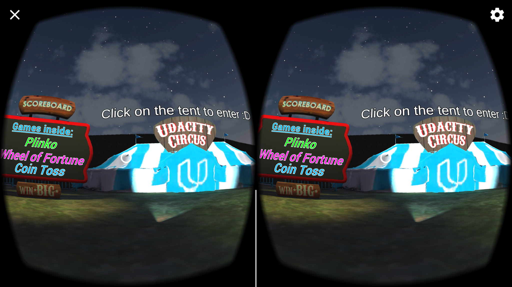
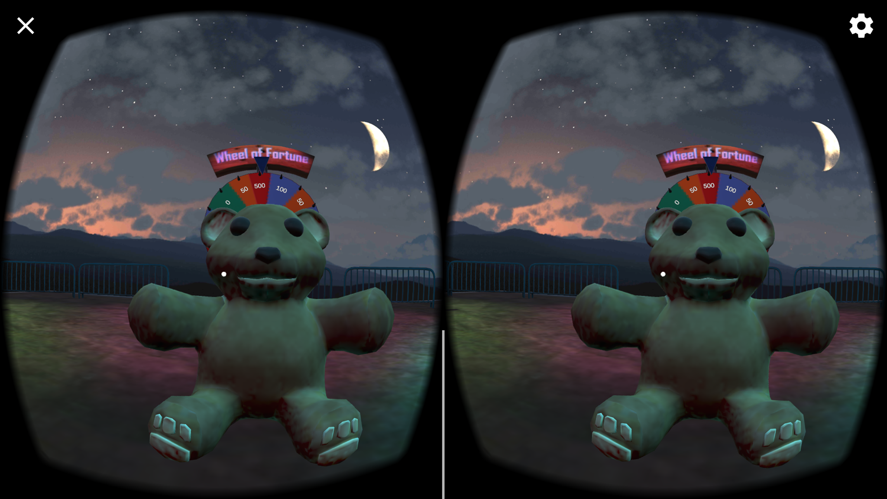
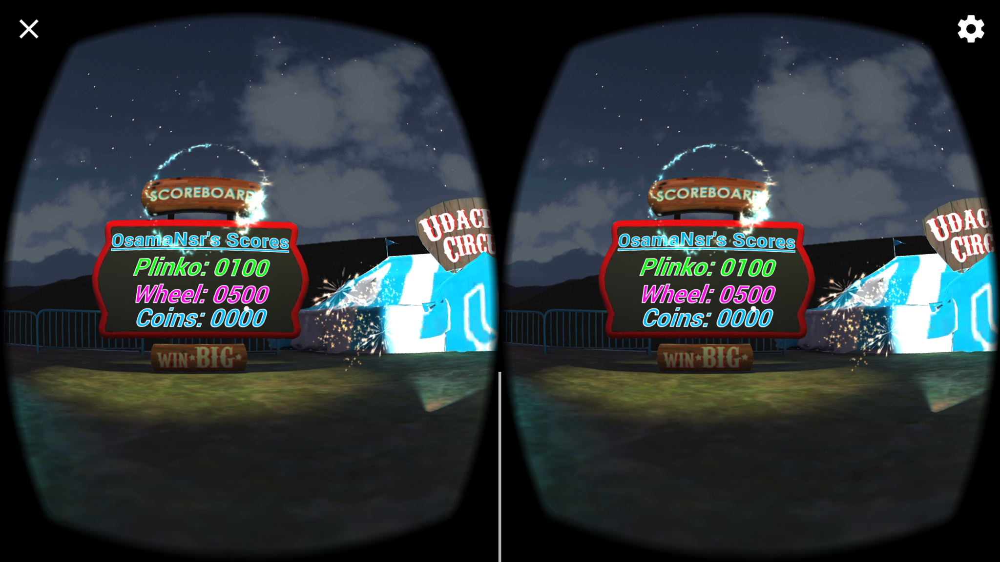

# Udacity Carnival
Starter project for the Udacity [VR Developer Nanodegree](http://udacity.com/vr) program.

- Course: Introduction to Virtual Reality
- Project: Udacity Carnival

### Versions Used
- [Unity LTS Release 2017.4.4](https://unity3d.com/unity/qa/lts-releases?version=2017.4)
- [GVR SDK for Unity v1.100.1](https://github.com/googlevr/gvr-unity-sdk/releases/tag/v1.100.1)
- [TextMesh Pro](https://assetstore.unity.com/packages/essentials/beta-projects/textmesh-pro-84126) v1.0.55

### Directory Structure
- The Unity project is the child directory of the repository and named according to the associated lesson.
- The Unity project is 'cleaned' and includes the `Assets` folder, the `ProjectSettings` folder, and the `UnityPackageManager` folder.

### GVR SDK for Unity
- `GoogleVR` > `Demos` is not included.
- `GoogleVR` > `GVRVideoPlayer.unitypackage` is not included.
- The `Max Reticle Distance` value for the `GvrReticlePointer` used in the scene is set to `20` instead of the default `10`.
- Scripts applicable to the course have been updated to reflect Unity's API change from `UnityEngine.VR` to `UnityEngine.XR`.

>**Note:** If for any reason you remove and re-import GVR SDK for Unity v1.100.1, make sure you accept any API update pop-up prompts triggered by Unity. Alternatively, you can manually run the API updater (Unity menu `Assets` > `Run API Updater...`) after the import has completed.

### Student edit:
1_) I used Unity 2017.4.4

2_) Build for Android

3_) apk included: Udacity-Carnival/Builds.rar

4_) Screenshots:

